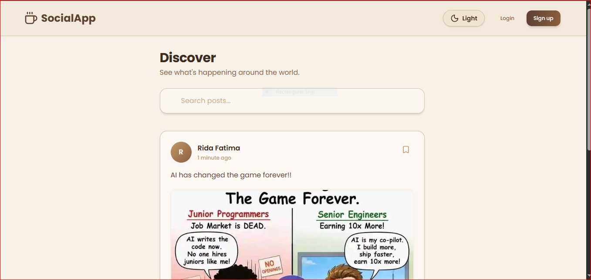
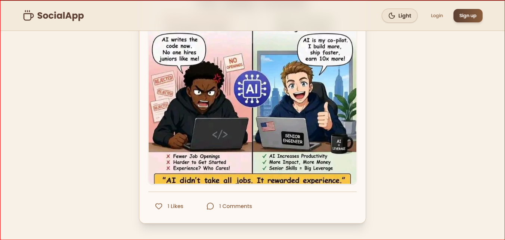
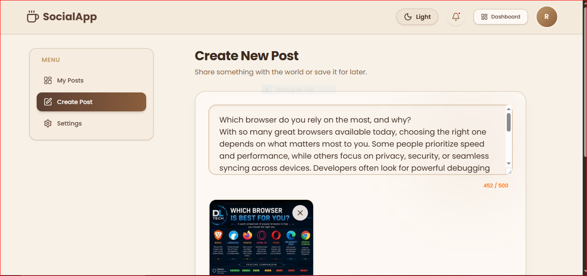
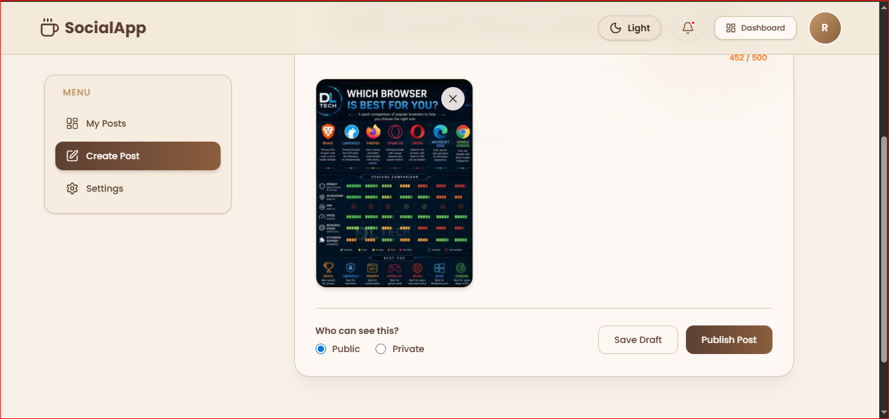
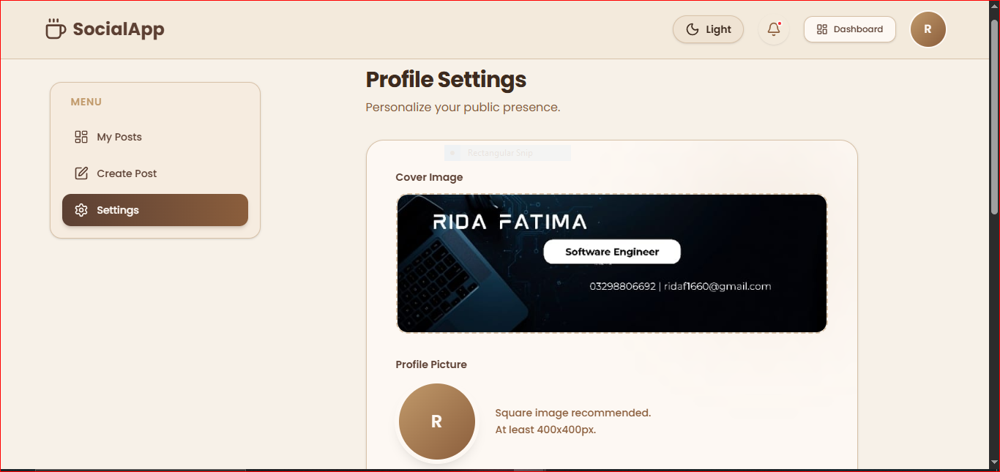
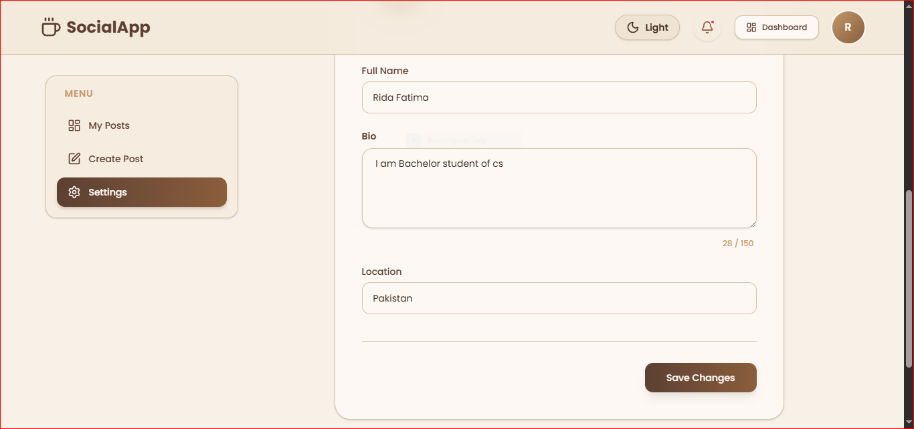
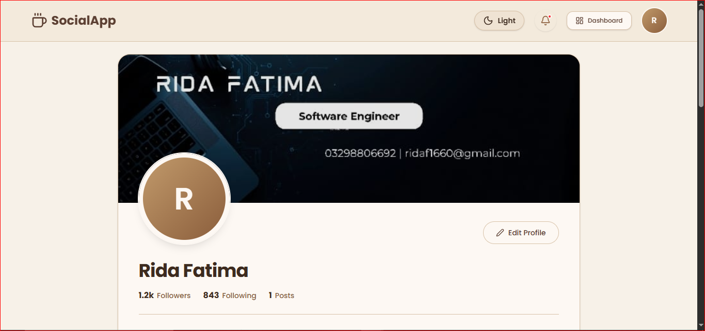
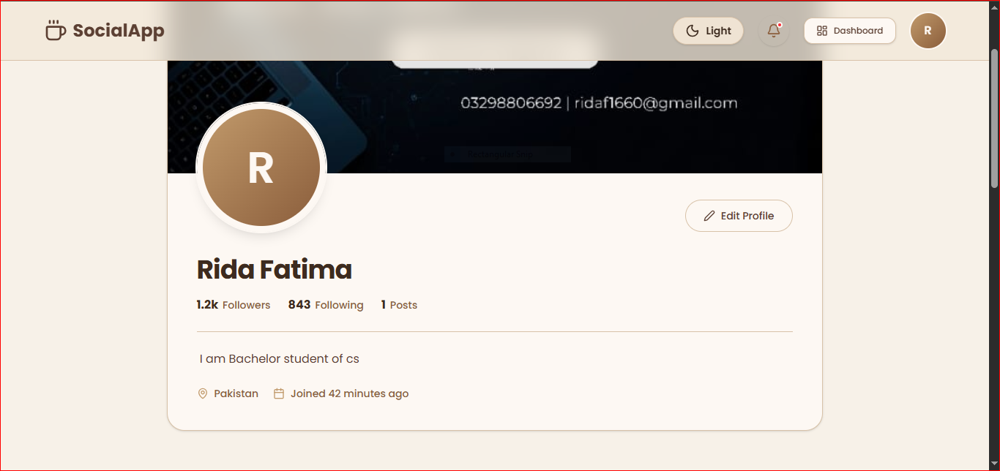
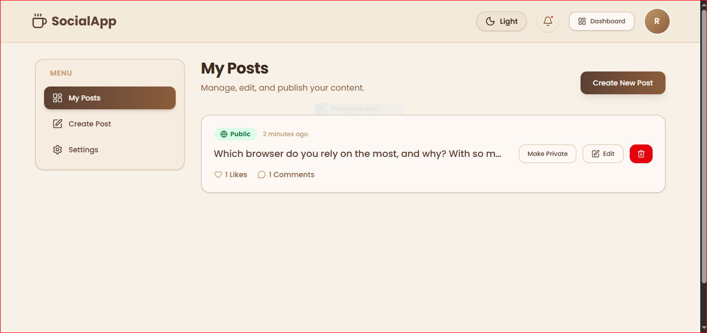

# SocialApp --- Facebook Inspired Social Media Platform

> A modern React-based social media application with authentication,
> post management, comments, likes, user profiles, and dashboard
> functionality powered entirely by localStorage.

------------------------------------------------------------------------

# 1. Project Title & Tagline

**Project:** SocialApp

**Tagline:** A Facebook-inspired social media platform built with React,
Tailwind CSS, React Router, Context API, and localStorage.

------------------------------------------------------------------------

# 2. Live Demo

 **Live Demo:**\
 **socialapp-ridafatima-git-main-ridaf1660-7909s-projects.vercel.app**


------------------------------------------------------------------------

# 3. Screenshots


## Feed Page




## Create Post





## Profile Page





## Dashboard



------------------------------------------------------------------------

# 4. Tech Stack

-   React (Vite)
-   React Router v6
-   Tailwind CSS
-   React Hook Form
-   Context API
-   localStorage
-   JavaScript (ES6+)
-   HTML5
-   CSS3
-   clsx

------------------------------------------------------------------------

# 5. Features

-   User Signup & Login
-   Authentication using Context API
-   Persistent Login Session
-   Protected Routes
-   Public Feed
-   Create Posts
-   Edit Posts
-   Delete Posts
-   Draft Posts
-   Publish Posts
-   Public/Private Posts
-   Like / Unlike Posts
-   Comment System
-   Delete Own Comments
-   User Profile
-   Profile Settings
-   Avatar Upload
-   Cover Image
-   Responsive Design
-   Dashboard
-   Reusable Components
-   Search Posts (Bonus)
-   Bookmark Posts (Bonus)
-   Dark Mode (Bonus)
-   Character Counter (Bonus)
-   Image Preview Before Upload (Bonus)

------------------------------------------------------------------------

# 6. How to Run Locally

``` bash
git clone <YOUR_GITHUB_REPOSITORY_LINK>
cd social-app
npm install
npm run dev
```

Open:

    http://localhost:5173

------------------------------------------------------------------------

# 7. Folder Structure

``` text
src/
│
├── components/
│   ├── layout/
│   ├── post/
│   ├── profile/
│   └── ui/
│
├── context/
├── hooks/
├── pages/
│   └── dashboard/
├── utils/
├── App.jsx
├── main.jsx
└── index.css
```

------------------------------------------------------------------------

# 8. localStorage Data Structure

## users

``` js
{
 id,
 name,
 email,
 password,
 bio,
 location,
 avatar,
 coverImage,
 joinedAt
}
```

## posts

``` js
{
 id,
 authorId,
 description,
 image,
 isPublic,
 isDraft,
 createdAt,
 updatedAt
}
```

## comments

``` js
{
 id,
 postId,
 authorId,
 text,
 createdAt
}
```

## likes

``` js
{
 id,
 postId,
 userId,
 createdAt
}
```

------------------------------------------------------------------------

# 9. What I Learned

Building this project helped me strengthen my React fundamentals and
understand how a real-world frontend application is structured. I
learned how to manage authentication using Context API, navigate between
pages with React Router, and build reusable components for a cleaner
codebase. I also gained practical experience working with localStorage
to implement CRUD operations without a backend. Implementing protected
routes, responsive layouts, and form validation with React Hook Form
improved my problem-solving skills. Overall, this project increased my
confidence in developing modern React applications and writing
maintainable frontend code.

------------------------------------------------------------------------

# 10. Known Limitations & Future Improvements

Current limitations:

-   Uses localStorage instead of a real database.
-   Authentication is frontend-only.
-   Images are stored as Base64 strings.
-   No real-time updates.
-   No email verification or password recovery.

Future improvements:

-   Integrate a backend (Node.js + Express).
-   Store data in MongoDB.
-   Implement JWT authentication.
-   Add real-time notifications.
-   Add friend requests and messaging.
-   Support image cloud storage.
-   Improve performance with pagination and lazy loading.

##  Presentation Video

 [Watch the Loom Presentation](https://www.loom.com/share/1dd206adf61045e2a571a6af4dd53bb7)


